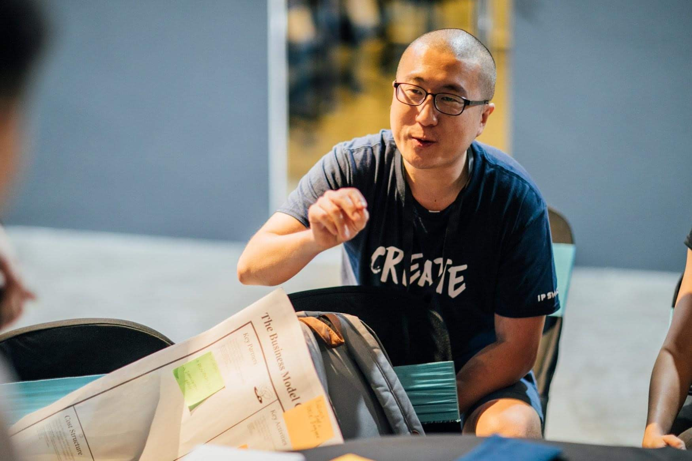
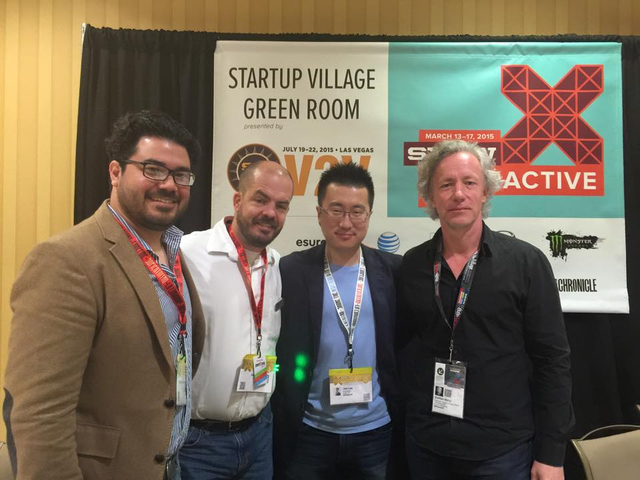
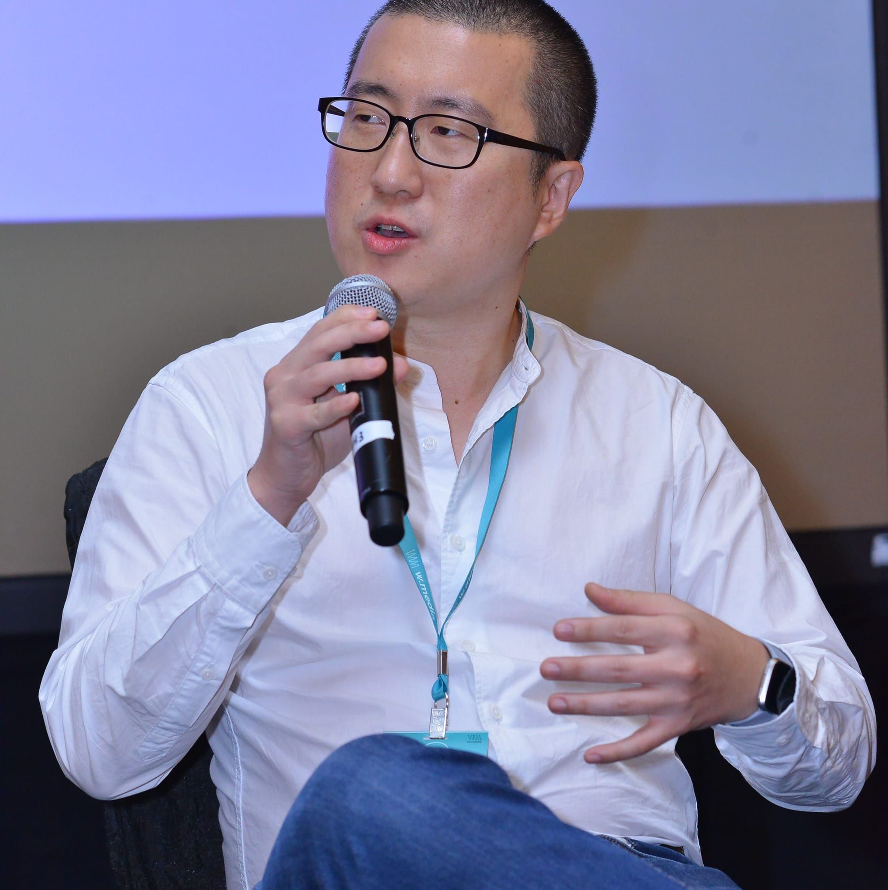

# Jae W. Lee

Technology executive, founder, and product builder working across AI, platforms, and digital transformation.

[LinkedIn](https://www.linkedin.com/in/leejaew/) • [Blog](https://blog.jael.ee) • [Amazon Author](https://www.amazon.com/author/leejaew) • [Google Scholar](https://scholar.google.com/citations?hl=en&view_op=list_works&gmla=AEk_c1uPgFbZsaQRWRXWPYNUnkDJEkTufmAcLtW9m0fjLk-MdzfdXZs3V444Bncl42n1ufa9lSii94fg2c6GOQ&user=iyafmpcAAAAJ) • [Forbes Technology Council](https://www.google.com/search?q=site%3Ahttps%3A%2F%2Fwww.forbes.com%2Fcouncils%2Fforbestechcouncil+jae+lee&sca_esv=55e9f3c856495c1e&rlz=1C5CHFA_enSG1091SG1091&sxsrf=ANbL-n7yaFxVl-bcE_-x9OF93ufeIijErw%3A1776276379744&ei=m9Pfae2NLZ7g1e8PkPmF8Q0&biw=1470&bih=780)

## About

Jae builds AI-powered products, enterprise platforms, and digital systems that solve operational problems at real scale. His work spans APAC, North America, and the GCC across logistics, telehealth, travel, higher education, enterprise workflow, brand experience, and applied AI.

He has worked as founder, CTO, VP Engineering, Digital Director, and product builder, leading globally distributed teams, shipping production systems, and helping organizations move from concept to commercial execution. Across that journey, he has combined hands-on engineering with product strategy, enterprise integration, and delivery leadership.

## What Jae has built

Jae has led and shipped products across multiple categories:

- AI and agent-powered products, including MCP servers, custom GPTs, RAG workflows, and applied LLM tools
- High-volume logistics and supply chain systems with real-time integrations and large API throughput
- Telehealth and healthcare platforms with video, IoT, CRM, and public-sector rollout components
- Travel and OTA platforms with fraud detection, payments, listings, and partner integrations
- Consumer, social, and community platforms across mobile, web, and content systems
- Enterprise web, app, and digital transformation programs for public and private sector organizations

## Selected career story

### Building AI for operations

Jae is currently Co-Founder and CEO of FMInsight, an AI agent-powered platform for facility management. The product is designed to help building operations teams move from reactive issue handling toward predictive, proactive decision-making.

Before that, during Antler in MENAP, he helped shape the market thesis, product direction, and early validation work behind the company.

### Leading digital transformation

At MBLM in Dubai, Jae led digital transformation and brand experience work across the GCC and Korea. He directed web, app, and UI or UX programs for organizations such as Dubai World Trade Centre Hospitality, Dubai Exhibition Centre, UAE Accountability Authority, and Abu Dhabi Accountability Authority. He also supported internal GenAI adoption by creating workflows, prompt systems, and Python tools that reduced manual effort and improved delivery quality.

### Scaling complex platforms

At Quincus, Jae led a 70+ person engineering organization across 8 countries. The platform supported supply chain visibility and logistics orchestration at a scale of 800 million monthly API calls. His work included AI and ML capabilities for dynamic rating and forecasting, as well as enterprise integrations across ERP, WMS, OMS, gateways, middleware, and partner adapters.

### Building venture-backed products

At Kempus, Jae co-founded a zero-knowledge social platform for verified college students, raised $3 million in seed funding, and expanded to 33 universities in the United States. He led the company across product, engineering, growth, and execution, including AI-supported personalization and a RAG-based career guidance workflow.

### Shipping travel and healthcare products

As Founding CTO of WorldRoamer, Jae built the technology foundation for an OTA platform that launched with more than 50,000 listings at MVP stage. The platform included CRS and channel manager integrations, payment and partnership integrations, and ML-based fraud detection.

At RingMD, he led engineering for a telemedicine platform recognized within Singapore's Ministry of Health regulatory sandbox. The work combined real-time consultations, wearable IoT integrations, Salesforce Sales Cloud across 32 countries, and AI-assisted engagement workflows.

### Building for global brands

Earlier in his career, Jae led and delivered digital product and creative technology work for organizations including Samsung, Hyundai, Kia, L'Oréal Korea, 3M Korea, MCM Worldwide, Hanwha Group, Diageo, and the Korea Tourism Organization. His work across agencies, startups, and ventures covered mobile apps, social platforms, AR, branded experiences, analytics, and customer-facing digital systems.

## Recent AI and platform projects

### MCP, GPT, and Agents

- [SG MRT Exits MCP](https://github.com/leejaew/sg-mrt-exits-mcp)
  A production-ready MCP server connecting AI agents to Singapore MRT station-exit data for navigation, accessibility, logistics, retail analysis, emergency response, and tourism use cases.

- **Odoo MCP**  
  A production-ready MCP server that connects AI agents with Odoo ERP workflows, including CRUD operations, workflow execution, model introspection, module support, and demo data generation.

- **VisitKorea MCP Series**
  A set of production-ready [MCP services for Korea tourism](https://github.com/leejaew/visitkorea-mcp), wellness tourism, and medical tourism datasets, with multilingual search, GPS discovery, structured retrieval, sync workflows, caching, validation, and rate limiting.

- [SG MRT Exit Finder](https://chatgpt.com/g/g-69df2b17cf108191ac224a88f616f05b-sg-mrt-exit-finder)
  A custom GPT backed by a self-developed API and OpenAI action schema for MRT station-exit lookup, route assistance, and proximity-based discovery.

- [Hawker Buddy SG](https://chatgpt.com/g/g-69b8269717688191841386049db8b604-hawker-buddy-sg)
  A custom GPT for personalized Singapore hawker recommendations using curated public data and location-aware prompting. Published [Hawker API via RapidAPI](https://rapidapi.com/leejaew/api/hawker/) hub.

### Full-stack AI products

- [Memtoon.com](https://memtoon.com)
  An AI SaaS product that converts real Google Calendar and Microsoft Outlook events into personalized manga-style webtoon strips using a dual-AI pipeline.

- [Ripplet.me](https://github.com/leejaew/ripplet.me)
  An open-source Reddit-style discussion platform with AI moderation, forum-level controls, audit logging, automation, and hardened security.

- [SecureChat](https://github.com/leejaew/template-secure-chat)
  An open-source encrypted group chat starter platform with browser-side end-to-end encryption, secure room key exchange, WebRTC signaling support, expiring invites, and hardened deployment controls.

## Industries and work context

Jae's work has crossed:

- Logistics and supply chain
- Healthcare and telemedicine
- Travel and tourism
- Higher education and student platforms
- Enterprise software and ERP
- Government and public sector digital transformation
- Retail, consumer apps, and brand experience
- Applied AI, agents, and workflow automation

He has built for B2B, B2C, and B2G environments, from zero-to-one startups to enterprise-grade systems used across multiple countries.

## Speaking and mentoring

Jae has spoken and lectured across startup, product, cloud, and digital transformation contexts, including SXSW, the Cloud and Data Center Convention in Singapore, NUS Business School, James Madison University, and industry panels across Asia.

He also mentors founders and startup teams through programs including Founder Institute, Wavesparks, Ignyte, and youth and startup initiatives in the region.

## Publications

Jae is the author of:

- *[Python Programming Beginner's Cookbook](https://www.amazon.com/Python-Programming-Beginners-Cookbook-Jae-ebook/dp/B0CRBG59DM)*
- *[Baseball Inspired Python Tutorial For Beginners](https://www.amazon.com/Baseball-Inspired-Python-Tutorial-Beginners-ebook/dp/B0C24LVVJM)*

He also contributes writing on AI readiness, engineering effectiveness, product thinking, and systems design through Forbes Technology Council and related publications.

## Focus

- AI product strategy and applied GenAI
- LLM applications, RAG, prompt systems, and AI agents
- MCP architecture and enterprise tool integration
- Platform architecture, APIs, and secure production systems
- ERP, CRM, and workflow transformation
- Product strategy, MVP delivery, and commercialization

## Advisory

Jae advises founders and companies on AI strategy, AI augmentation, and the move toward AI-native products and operations. He also provides guidance on best practices for using vibe coding platforms, including workflows, tooling, guardrails, and execution. Advisory bookings are accepted via [Hubble](https://app.hubble.social/jaewanglee).

## Contact

For collaborations, advisory, speaking, product leadership, or AI transformation work, connect via [LinkedIn](https://www.linkedin.com/in/leejaew/).
